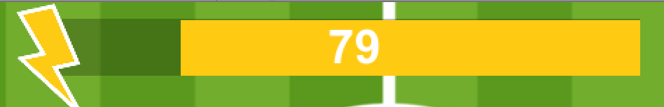

# Game Basic Information #

## Summary ##

**A paragraph-length pitch for your game.**

In the distant future, Earth has been overtaken by alien invaders. However, they agree to allow their human captives freedom on one condition: challenge each other in one-on-one games of vehicular soccer! In 2D Rocket League, challenge your friends in epic, fast paced 2D action as you try to outmanuever each other and score goals. Utilize the boost to strategically outpace your opponents and swoop in for quick goals. In 2D Rocket League, the action is always fast and fresh!

## Gameplay explanation ##

**In this section, explain how the game should be played. Treat this like a manual within a game. It is encouraged to explain the button mappings and the most optimal gameplay strategy.**

The object of the game is to hit the ball into the other player's goal. After 5 minutes, whoever scored more goals is the winner. If you are the red player, you should hit the ball in the blue goal and if you are the blue player hit the ball in the red goal. In addition to basic movement, each player can activate their boost for a burst of speed. However, they can only boost as long as there is meter in their yellow boost gauge. To refill your boost gauge, simply pick up the yellow power ups that randomly spawn around the field. Make good use of your movement and keep track of your boost gauge to outmanuever the opponent!

If you are the red player:
- Move with the arrow keys
- Boost with the space bar

If you are the blue player:
- Move with WASD
- Boost with left shift

# Main Roles #

Your goal is to relate the work of your role and sub-role in terms of the content of the course. Please look at the role sections below for specific instructions for each role.

Below is a template for you to highlight items of your work. These provide the evidence needed for your work to be evaluated. Try to have at least 4 such descriptions. They will be assessed on the quality of the underlying system and how they are linked to course content. 

*Short Description* - Long description of your work item that includes how it is relevant to topics discussed in class. [link to evidence in your repository](https://github.com/dr-jam/ECS189L/edit/project-description/ProjectDocumentTemplate.md)

Here is an example:  
*Procedural Terrain* - The background of the game consists of procedurally-generated terrain that is produced with Perlin noise. This terrain can be modified by the by the game at run-time via a call to its script methods. The intent is to allow the player to modify the terrain. This system is based off the component design pattern and the procedural content generation portions of the course. [The PCG terrain generation script](https://github.com/dr-jam/CameraControlExercise/blob/513b927e87fc686fe627bf7d4ff6ff841cf34e9f/Obscura/Assets/Scripts/TerrainGenerator.cs#L6).

You should replay any **bold text** with your own relevant information. Liberally use the template when necessary and appropriate.

## User Interface

**Describe your user interface and how it relates to gameplay. This can be done via the template.**

Our UI packs the most important information in the center of the screen. The timer is the first thing in the center, as it is shared between both players. On either side is each players score, differentiated by the red and blue colors of their sprites. Lastly, the
yellow colors of the boost bars are eye catching so you can clearly tell how much boost you have left in the tank. The lightning bolt
motif clearly demonstrates this, and by having the boost deplete toward the center, similar to fighting games, it helps to compress
all the information towards the center so the player can see all the important information at a glance.

## Movement/Physics

**Describe the basics of movement and physics in your game. Is it the standard physics model? What did you change or modify? Did you make your own movement scripts that do not use the phyics system?**

Our project made use of the Unity physics system and did not deviate much from it. Even though our game is shown from a 2D top-down perspective, looking at the editor and the code itself shows that we used Unity's 3D physics engine. The game makes use of
rigid bodies and sphere colliders as a means of handling movement and game logic. These components helped us tweak the game
feel and physics by setting drag and mass values. Giving the soccer ball a higher drag value helped stop the feeling that
it was "floating," for example.

Our physics implementation also handled collisions between game objects. When a player collides with a ball, a kick force value is applied to the ball in the direction the player collided with the ball. If the kicked ball collides with the out of bounds areas of the playing field, it is merely repelled back with a barrier force value back into the playing field. 

Player physics involves not only this movement, but also their boosting movement as well. When a player decides to boost,
they receive a x2 speed increase through the RigidBody AddForce() method in whatever direction the player pressed. One
interesting gameplay consequence of this was to have double the kick force applied to the ball when a player boosts into it.
If a player were to normally collide into the ball, however, then the ball gets kicked a smaller distance.

## Animation and Visuals

**A brief description**

Create assets needed for our game and take this video (https://www.youtube.com/watch?v=UjqWUmmoq-E&t=170s) as an reference to complete the design of the game scene. Use a little bit exaggerated graphics visual style when set the ratio of players, soccer balls, and soccer fields.

**Intersects with game feel:**

See the 5,6,7,8 points in game feel part.

 > 5. Add a "head" to the player's sprite, and implement a RotationLerp() function to make the head face the direction in which the player is moving towards. Since we finally decided to use WASD to make movement, it would provide the player a better sence of control.

 > 6. Change the Timer's text color from Color.Black to Color.Red when there's only one minute left.  

 > 7. Add color to the gate. When doing game testing, we find that some students were confused about which gate they should shoot to at the very begining. By adding the same color of the player to the gate, this problem will no longer exist.
 
 > 8. Add boosting sould/animation to make the process more visible to player. 

**List your assets including their sources, and licenses.**

**All assets used in our game:**

**Assets list:**

**Downloaded online:**

football field(modified).jpg - http://www.16pic.com/vector/pic_1244046.html

comment: This assets have been modified by myself.

License: No free license, for educational purpose only. 

 **Assets made by myself (see sprites folder):**

  player1.PNG

  player2.PNG

  honeycomb.png

  energy_icon.png

  LargeEnergyBall.png

  MediumEnergyBall.png

  SmallEnergyBall.png

  panel.png

  White-square.jpg

  ball.png

  score_blue.png

  score_red.png

  soccer field.jpeg

**Design of the Game Scene:**

**Animation**

**Boost animation:**

 - player1 boost animation:                    

      

 - player2 boost animation:

**Countdown Timer animation:**

 - Timer:

 - Timer(alarming):

**Energy bar animation:**

**Scrolling Text:**

 - When player score a goal:

## Input

**Describe the default input configuration.**
Since our game was designed to be an arcade-style game, our default input configuration was pretty standard,
i.e. the player control movements are entirely controlled by four arrow keys, one for each direction as in many
2-dimensional platformer or arcade-style games. Since this is a multiplayer game (up to 2 players), and since our
input controllers is the keyboard itself, the second-player controls are the also standard WASD controller movements.
(W - up, A - left, S - down, D - right). While we can configure the input to be controllers like an X-Box or Playstation
controllers (which would also allow for more players to be able to play at once) the game is currently set up to be played
entirely on a computer/keyboard setup. Besides just player movement controlled by four keys per player, there is also a
'boost' button which allows the players to speed up during movement when held down (if there is boost available).
For player one (arrow key input) the boost button is the spacebar. For player two (wasd input), the boost button is the left
'Shift' key. While I was in charge of input, I also helped create the player movement controller script, which felt smoother
than the original script, and which was later implemented as the final version of the player movement controller script.

**Add an entry for each platform or input style your project supports.**

Our game is currently supported for the PC and Mac platforms.

**Document what game states and game data you managed and what design patterns you used to complete your task.**

For our game, we implemented the command pattern for player input as well as the singleton pattern for handling sound
(see below under Audio sub-role for more details).

# Sub-Roles

## Audio

**List your assets including their sources, and licenses.**

ball_kick1.wav - https://www.partnersinrhyme.com/soundfx/sports_sounds/sports_foot-ball-kick_wav.shtml  
License: Royalty Free

boost1.wav - https://freesound.org/people/OnlyTheGhosts/sounds/251430/  
License: Creative Commons Attribution 3.0 Unported (CC BY 3.0) 

car_collision.wav - https://freesound.org/people/Halleck/sounds/121622/  
License: Creative Commons Attribution 3.0 Unported (CC BY 3.0)

pickup1.wav - https://freesound.org/people/CharlieWD100/sounds/440559/  
License: Creative Commons 1.0

score2.wav - unknown

bg_music.mp3 - unknown

**Describe the implementation of your audio system.**

For the handling of audio assets, our project opted for a singleton manager pattern implemented in a script called SoundManager.cs. The rationale for doing so was to have an easy and seamless way to execute code related to sound files at any script at any point in the project. In essence, the script acts as a way to handle global variables related to playing/stopping sound assets. An additional benefit is being able to do this across scenes: the pattern allows for the inclusion/exclusion of sound without the data being destroyed.

**Document the sound style.** 
The sound style opts for a slightly more realistic set of acoustics. We wanted to go for a light sci-fi feel, something
somewhat grounded within reality. As such, sounds like the one that plays when a player boosts or picks up an energy orb
are made to emphasize that feel, while the more mundane sounds like the ball being kicked emphasizes the realistic feel.

## Gameplay Testing

**Add a link to the full results of your gameplay tests.**

https://docs.google.com/forms/d/1TLqhXBkHoL1-e15zkhrhCoo36_v0tn9G1K_VUt4mpUg/edit?usp=sharing_eil&ts=5cfcae45

**Summarize the key findings from your gameplay tests.**

Overall, most praise was directed towards the simplicity yet fun design involved with the gameplay. People enjoyed the boosting mechanic as well as the collisions system. However, many criticisms were made towards how the ball would often get stuck in the corners of the barriers, as well as player movement being sluggish. These gameplay testing results were taken into account for the final product.

## Narrative Design

**Document how the narrative is present in the game via assets, gameplay systems, and gameplay.**

The minimalist stylings of the player sprites allow the player to easliy project themselves into the game. The player can think of the sprite as any vehicle: it's not locked into a car for instance. With the dot representing the driver, there is a lot of room to experiment. The futuristic soccer theme is easily demonstrated in the field , especially the alternating stripes of green 

## Press Kit and Trailer

**Include links to your presskit materials and trailer.**

**Describe how you showcased your work. How did you choose what to show in the trailer? Why did you choose your screenshots?**

## Game Feel

**Document what you added to and how you tweaked your game to improve its game feel.**

 1. Use WASD (arror keys) to control instead of using A/D (Left/Right keys) to rotate along with W(Up arror key) to move forward, which makes the player much easier to control. 
 
 2. Implement a Energy System which introduce variables to the player's speed. The players can now use their own strategy to decide when/how much they would like to use energy to boost in order to make a good kick/defense.

    We also implement 2 ways of energy recharging:

 - Passive Energy regeneration: both players will passively get 1% of energy every 2 secongd. 

 - By actively collecting the energy ball: The energySpawner will generate a new energy ball (small/medium/large ball with a generate probability of 50%/30%/20%) every 5 second at a random postion. The maximum number of the uncollected enery ball is set to 6. 
 
 3.  Make sure the ball go whatever direction the player pressed, which improve player's feel of control. See more implement details in the Movement/Physics part.
 
 4. Add unvisible barriers around the field to prevent the ball to go out of the field. Also add barrier collision so ball no longer gets stuck in borders/corners.

 5. Add a "head" to the player's sprite, and implement a RotationLerp() function to make the head face the direction in which the player is moving towards. Since we finally decided to use WASD to make movement, it would provide the player a better sence of control.

 6. Change the Timer's text color from Color.Black to Color.Red when there's only one minute left.  

 7. Add color to the gate. When doing game testing, we find that some students were confused about which gate they should shoot to at the very begining. By adding the same color of the player to the gate, this problem will no longer exist.
 
 8. Add boosting sould/animation to make the process more visible to player. 
 
