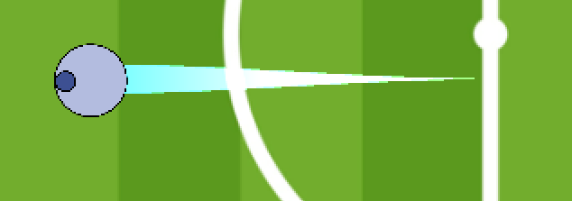

# Game Basic Information #

## Summary ##

**A paragraph-length pitch for your game.**

## Gameplay explanation ##

**In this section, explain how the game should be played. Treat this like a manual within a game. It is encouraged to explain the button mappings and the most optimal gameplay strategy.**

# Main Roles #

Your goal is to relate the work of your role and sub-role in terms of the content of the course. Please look at the role sections below for specific instructions for each role.

Below is a template for you to highlight items of your work. These provide the evidence needed for your work to be evaluated. Try to have at least 4 such descriptions. They will be assessed on the quality of the underlying system and how they are linked to course content. 

*Short Description* - Long description of your work item that includes how it is relevant to topics discussed in class. [link to evidence in your repository](https://github.com/dr-jam/ECS189L/edit/project-description/ProjectDocumentTemplate.md)

Here is an example:  
*Procedural Terrain* - The background of the game consists of procedurally-generated terrain that is produced with Perlin noise. This terrain can be modified by the by the game at run-time via a call to its script methods. The intent is to allow the player to modify the terrain. This system is based off the component design pattern and the procedural content generation portions of the course. [The PCG terrain generation script](https://github.com/dr-jam/CameraControlExercise/blob/513b927e87fc686fe627bf7d4ff6ff841cf34e9f/Obscura/Assets/Scripts/TerrainGenerator.cs#L6).

You should replay any **bold text** with your own relevant information. Liberally use the template when necessary and appropriate.

## User Interface

**Describe your user interface and how it relates to gameplay. This can be done via the template.**
Our UI packs the most important information in teh center of the screen. The timer is the first thing in the center, as it is shared between both players. On either side is each players score, differentiated by the red and blue colors of their sprites. Lastly, the
yellow colors of the boost bars are eye catching so you can clearly tell how much boost you have left in the tank. The lightning bolt
motif clearly demonstrates this, and by having the boost deplete toward the center, similar to fighting games, it helps to compress
all the information towards the center so the player can see all the important information at a glance.

## Movement/Physics

**Describe the basics of movement and physics in your game. Is it the standard physics model? What did you change or modify? Did you make your own movement scripts that do not use the phyics system?**

Our project made use of the Unity physics system and did not deviate much from it. Even though our game is shown from a 2D top-down perspective, looking at the editor and the code itself shows that we used Unity's 3D physics engine. The game makes use of
rigid bodies and sphere colliders as a means of handling movement and game logic. These components helped us tweak the game
feel and physics by setting drag and mass values. Giving the soccer ball a higher drag value helped stop the feeling that
it was "floating," for example.

Our physics implementation also handled collisions between game objects. When a player collides with a ball, a kick force value is applied to the ball in the direction the player collided with the ball. If the kicked ball collides with the out of bounds areas of the playing field, it is merely repelled back with a barrier force value back into the playing field. 

Player physics involves not only this movement, but also their boosting movement as well. When a player decides to boost,
they receive a x2 speed increase through the RigidBody AddForce() method in whatever direction the player pressed. One
interesting gameplay consequence of this was to have double the kick force applied to the ball when a player boosts into it.
If a player were to normally collide into the ball, however, then the ball gets kicked a smaller distance.

## Animation and Visuals

**List your assets including their sources, and licenses.**

All assets used in our game:

Assets list:

TO BE DONE

Game Scene:

**Animation**

Boost animation:

player1 boost animation:

player2 boost animation:

Countdown Timer animation:

Timer:

Timer(alarming):

.PNG)

Energy bar animation:

Scrolling Text:

When player score a goal:

**Describe how your work intersects with game feel, graphic design, and world-building. Include your visual style guide if one exists.**

## Input

**Describe the default input configuration.**

**Add an entry for each platform or input style your project supports.**

## Game Logic

**Document what game states and game data you managed and what design patterns you used to complete your task.**

For our game, we implemented the command pattern for player input as well as the singleton pattern for handling sound
(see below under Audio sub-role for more details).

# Sub-Roles

## Audio

**List your assets including their sources, and licenses.**

ball_kick1.wav - https://www.partnersinrhyme.com/soundfx/sports_sounds/sports_foot-ball-kick_wav.shtml  
License: Royalty Free

boost1.wav - https://freesound.org/people/OnlyTheGhosts/sounds/251430/  
License: Creative Commons Attribution 3.0 Unported (CC BY 3.0) 

car_collision.wav - https://freesound.org/people/Halleck/sounds/121622/  
License: Creative Commons Attribution 3.0 Unported (CC BY 3.0)

pickup1.wav - https://freesound.org/people/CharlieWD100/sounds/440559/  
License: Creative Commons 1.0

score2.wav - unknown

bg_music.mp3 - unknown

**Describe the implementation of your audio system.**

For the handling of audio assets, our project opted for a singleton manager pattern implemented in a script called SoundManager.cs. The rationale for doing so was to have an easy and seamless way to execute code related to sound files at any script at any point in the project. In essence, the script acts as a way to handle global variables related to playing/stopping sound assets. An additional benefit is being able to do this across scenes: the pattern allows for the inclusion/exclusion of sound without the data being destroyed.

**Document the sound style.** 
The sound style opts for a slightly more realistic set of acoustics. We wanted to go for a light sci-fi feel, something
somewhat grounded within reality. As such, sounds like the one that plays when a player boosts or picks up an energy orb
are made to emphasize that feel, while the more mundane sounds like the ball being kicked emphasizes the realistic feel.

## Gameplay Testing

**Add a link to the full results of your gameplay tests.**

**Summarize the key findings from your gameplay tests.**

## Narrative Design

**oDocument how the narrative is present in the game via assets, gameplay systems, and gameplay.** 

## Press Kit and Trailer

**Include links to your presskit materials and trailer.**

**Describe how you showcased your work. How did you choose what to show in the trailer? Why did you choose your screenshots?**

## Game Feel

**Document what you added to and how you tweaked your game to improve its game feel.**
